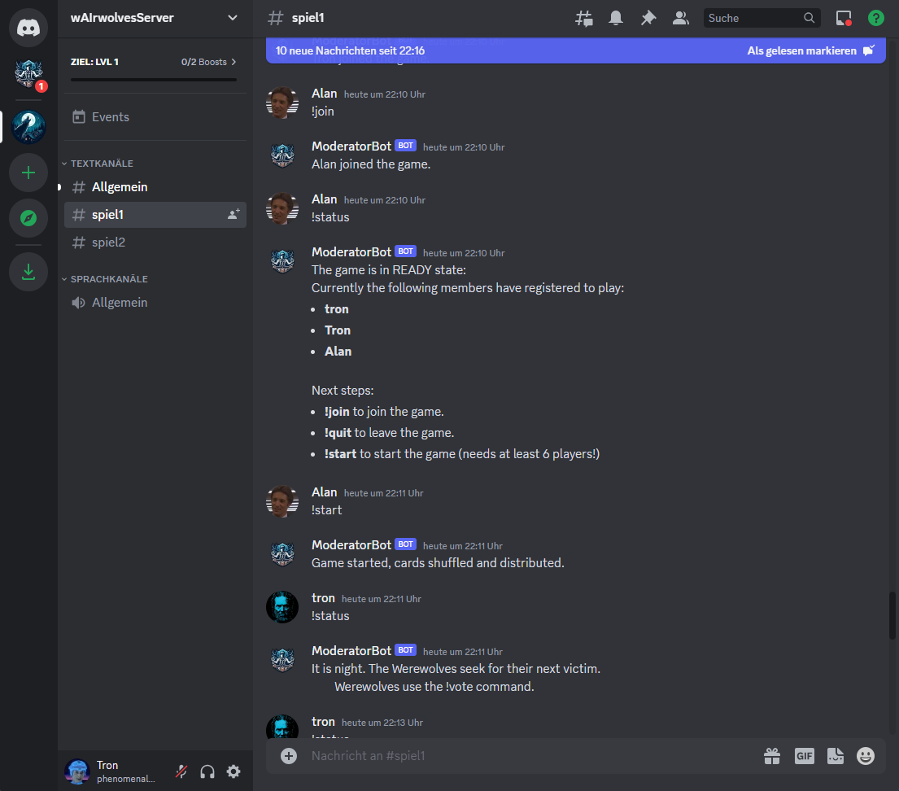
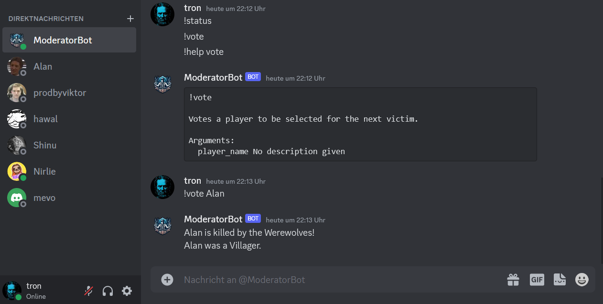

# Backdrop Build - Week 1 - Update

## Project Info
* Project: **PlayWerewolfWithAI** (wAIrewolves)
* GitHub Link: [BernLeWal/PlayWerewolfWithAI](https://github.com/BernLeWal/PlayWerewolfWithAI)

## Week 1 - Report

### One-Liner
A super short, punchy description of your project.

```
AI-agents play together/against humans the werewolves card game on Discord.
```

### What are you building?
Describe your project in a way that most people will understand. What does it do? Why are you building it? Why should people care? Speak like you are speaking to your target user, in plain language.

```
A case study how well AI-agents (using LLMs) act in human collaboration:
* Are AI agents on a par with humans when it comes to communication and collaboration? 
* Is it fun to play a board game with AI players?
* If not, what improvements could be made to bring AI agents closer to humans, and what could a technical implementation look like?
```

### Who are your ideal users?
Projects aren't specific enough about who their ideal users are and get totally stuck because of that. Focus on who would absolutely love to use what you're building―not in months, but today. Be very specific! Aim at identifying your first few ideal users first, because they will be your biggest help in iterating and pushing your project forward.

```
Two kinds of users:
1. Social and collaboration game enthusiasts enjoying their time together with a group of real-people and ai-agents who a curios about be competed by ai-agents the same way as from humans: cheating, secret-teaming, strategy, and more.
2. Developers for applied AI implementation with LLMs who want to fine-tune, improve and advance the LLM AI-technology not only to know/solve facts, but also to integrate in social human collaboration.
```

### What are you building with?
This information about your tech stack will be helpful for others to find your project in our directory and for grants. No worries if your stack changes over the course of the program, just let us know :)

```
Python, Discord.py, Huggingface, Transformers, Pytorch, OpenAI ChatGPT4+, Microsoft ImageCreator , StabilityAI (StableLM, StableDiffusion), Falcon-7B
```

### What have you shipped this week?
Tell everyone what you have shipped this week, no matter how big or small. What matters is to keep on shipping!

```
I shipped the prototype of the werewolve-card-game gaming platform, running as a guild/server on discord.
Human players can already start and join games against each other.
The next step is to create the first AI-agent to play together/against the humans.
```

## Appendix

Here you find some screenshots of the wAIewolves-game prototype implemented from scratch within one week in pure night-sessions beside my company work:

1. The "ready"-phase of the game: Joining and starting a wAIrewolves game


2. The "night"-phase of one round in the game: The werewolves cooperate secretly and decise for a victim.


3. The "day"-phase of one round: The villagers (together with the unknown werewolves) discuss and vote for a victim who could possibly be a Werewolf.

4. If villagers and werewolves are still alive, the next round starts with the "night"-phase.

5. This happens until all the villagers or all the werewolves are gone - GAME OVER.  
In the final screenshot the villagers cought the last werewolf - so they won.


