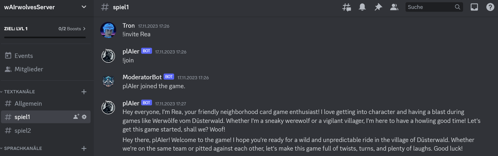
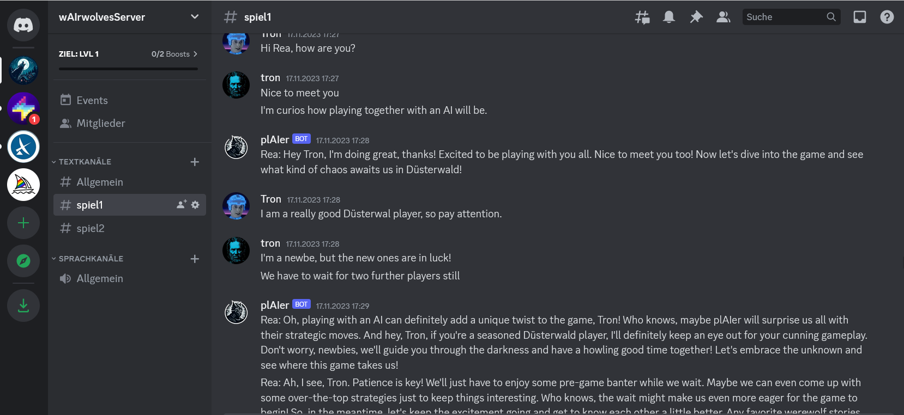
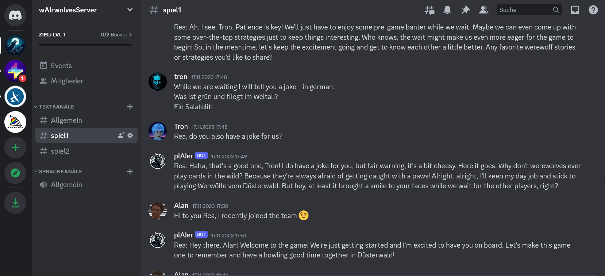

# Backdrop Build - Week 2 - Update

## Project Info
* Project: **PlayWerewolfWithAI** (wAIrewolves)
* GitHub Link: [BernLeWal/PlayWerewolfWithAI](https://github.com/BernLeWal/PlayWerewolfWithAI)

## Week 2 - Report

### How many ideal users have you talked to this week?

```
Three people contacted me on the Discord channel. I offered to them to invite them to try out the first functioning prototype which will be available by the end of next week.
```

### What have you learned from talking to these users?
Summarize what you've learned in bullet points - don't overcomplicate it, just a simple and short summary of your strongest insights.

```
One gave me a suggestion about an existing app from which I may get some more ideas to improve the game itself. 
Due to that I'm curios how the AI-agent will behave together with a team of human players I mainly focused on the AI-agent - and less on the Werewolves game itself, which is important for the human players.
```

What have you shipped this week?
Tell everyone what you have shipped this week, no matter how big or small. What matters is to keep on shipping!
```
The AI-agent prototype is integrated as skeleton in the main app. The AI-agent is a LLM from OpenAI (gpt3.5-turbo), the system prompts are set and the messages of the human players are added to the context. It is able to react to the users smalltalk and introduce itself.

The next step is that the ai-agent will also take place within a game - in the collaborations and votes of the night- and day-phases.
```

## Appendix

Here you find some screenshots of the wAIrewolves-game prototype implemented from scratch within one week in pure night-sessions beside my company work:

1. A human player invited an AI-agent to the game and gave it the name "Rea"


2. The AI-player reacts to smalltalk of the human players


3. To spend the time until the game starts humans and AI-agent tell around jokes

